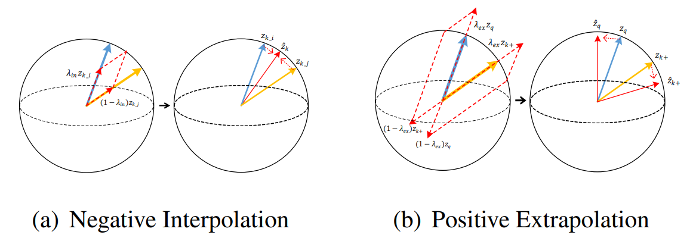
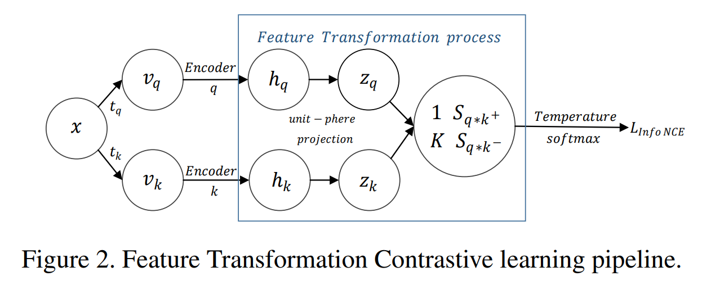

# Improving Contrastive Learning by Visualizing Feature Transformation

This project hosts the codes, models and visualization tools for the paper: 

> [**Improving Contrastive Learning by Visualizing Feature Transformation**](xxxx),  
> Rui Zhu*, Bingchen Zhao*, Jingen Liu, Zhenglong Sun, Chang Wen Chen  
> Proceedings of the IEEE/CVF International Conference on Computer Vision (ICCV), 2021, **Oral**  
> *arXiv preprint ([arXiv 2108.xxxxx](x))*   




## Highlights
- **Visualization Tools:**  We provide a visualization tool for pos/neg score distribution, which enables us to analyze, interpret and understand the contrastive learning process.
- **Feature Transformation:**  Inspired by the visualization, we propose a simple yet effective feature transformation (FT), which creates both hard positives and diversified negatives to enhance the training. 
FT enables to learn more view-invariant and discriminative representations. 
- **Less Task-biased:** FT makes the model less “task-bias”, which means we
can achievesignificant performance improvement on various downstream tasks (object detection, instance segmentation, and long-tailed classification). 



## Updates
   - Code, pre-trained models and visualization tools are released. (07/08/2021)


## Installation
This project is mainly based on the open-source code [PyContrast](https://github.com/HobbitLong/PyContrast).

Please refer to the [INSTALL.md](https://github.com/HobbitLong/PyContrast/blob/master/pycontrast/docs/INSTALL.md) and [RUN.md](https://github.com/HobbitLong/PyContrast/blob/master/pycontrast/docs/RUN.md) for installation and dataset preparation.


## Models
For your convenience, we provide the following pre-trained models on ImageNet-1K and ImageNet-100.

pre-train method | pre-train dataset | backbone | #epoch | ImageNet-1K | VOC det AP50| COCO det AP | Link
--- |:---:|:---:|:---:|:---:|:---:|:---:|:---:
Supervised | ImageNet-1K | ResNet-50 | - | 76.1 | 81.3 | 38.2| [download](https://cloudstor.aarnet.edu.au/plus/s/W2FST2pxKrC6HWp/download)
MoCo-v1 | ImageNet-1K | ResNet-50 | 200 | 60.6 | 81.5 | 38.5 | [download](https://dl.fbaipublicfiles.com/moco/moco_checkpoints/moco_v1_200ep/moco_v1_200ep_pretrain.pth.tar)
MoCo-v1+FT | ImageNet-1K | ResNet-50 | 200 | 61.9 | 82.0 | 39.0 | [download](https://cuhko365-my.sharepoint.com/:u:/g/personal/219019048_link_cuhk_edu_cn/EXy5EHiwvtBMt9dPlAXk69QB23U8tjK07JJ4B0l-24ZIOg?e=0FXWN8)
MoCo-v2 | ImageNet-1K | ResNet-50 | 200 | 67.5 | 82.4 | 39.0 | [download](https://dl.fbaipublicfiles.com/moco/moco_checkpoints/moco_v2_200ep/moco_v2_200ep_pretrain.pth.tar)
MoCo-v2+FT | ImageNet-1K | ResNet-50 | 200 | 69.6 | 83.3 | 39.5 | [download](https://cuhko365-my.sharepoint.com/:u:/g/personal/219019048_link_cuhk_edu_cn/EWmxeCue5hhFmGZG-qaJgDABJoQiHtppl7CyZyqXPngNDA?e=5IgLoV)
MoCo-v1+FT | ImageNet-100 | ResNet-50 | 200 | IN-100 result 77.2 | - | - | [download](https://cuhko365-my.sharepoint.com/:u:/g/personal/219019048_link_cuhk_edu_cn/EbuNGnkSjGdOmCceRd-3qfwBK3pnKzpr2qS1BEblQo0rUg?e=eFF70L)
**Note:** 
- See our paper for more results on different benchmarks.


## Usage

### Training on IN-1K
    python main_contrast.py --method MoCov2 --data_folder your/path/to/imagenet-1K/dataset  --dataset imagenet  --epochs 200 --input_res 224 --cosine --batch_size 256 --learning_rate 0.03   --mixnorm --mixnorm_target posneg --sep_alpha --pos_alpha 2.0 --neg_alpha 1.6 --mask_distribution beta --expolation_mask --alpha 0.999 --multiprocessing-distributed --world-size 1 --rank 0 --save_score

### Linear Evaluation on IN-1K
    python main_linear.py --method MoCov2 --data_folder your/path/to/imagenet-1K/dataset --ckpt your/path/to/pretrain_model   --n_class 1000 --multiprocessing-distributed --world-size 1 --rank 0 --epochs 100 --lr_decay_epochs 60,80

### Training on IN-100
    python main_contrast.py --method MoCov2 --data_folder your/path/to/imagenet-1K/dataset  --dataset imagenet100  --imagenet100path your/path/to/imagenet100.class  --epochs 200 --input_res 224 --cosine --batch_size 256 --learning_rate 0.03   --mixnorm --mixnorm_target posneg --sep_alpha --pos_alpha 2.0 --neg_alpha 1.6 --mask_distribution beta --expolation_mask --alpha 0.999 --multiprocessing-distributed --world-size 1 --rank 0 --save_score

### Linear Evaluation on IN-100
    python main_linear.py --method MoCov2 --data_folder your/path/to/imagenet-1K/dataset  --dataset imagenet100  --imagenet100path your/path/to/imagenet100.class  --n_class 100  --ckpt your/path/to/pretrain_model  --multiprocessing-distributed --world-size 1 --rank 0 
    
### Transferring to Object Detection
Please refer to [DenseCL](https://github.com/WXinlong/DenseCL) and [MoCo](https://github.com/facebookresearch/moco) for transferring to object detection.


### Visualization Tools
- Our visualization is offline, which almost does not affect the training speed.
Instead of storing K (65536) pair scores, we save their statistical mean and variance to represent the scores’ distribution. 
You can refer to the original paper for the details.

- Visualization code is [line 69-74](memory/memory_moco.py) to store the scores.
And then we further process the scores in the [IpythonNotebook]() for drawing.

## Citations
Please consider citing our paper in your publications if the project helps your research. BibTeX reference is as follow.
```
@inproceedings{zhu2021Improving,
  title={Improving Contrastive Learning by Visualizing Feature Transformation},
  author={Zhu, Rui and Zhao, Bingchen and Liu, Jingen and Sun, Zhenglong and Chen, Chang Wen},
  booktitle =  {Proceedings of the IEEE/CVF International Conference on Computer Vision (ICCV)},
  year={2021}
}
```
